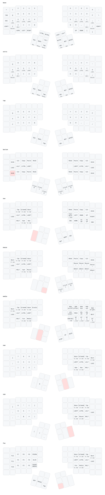

# adv360-zmk-config

ZMK firmware for the Kinesis Advantage 360 Pro, built with Nix on upstream ZMK. The keymap is a Miryoku-style layout (10 layers, timeless home-row mods, thumb layer-taps) written as a plain ZMK keymap with [zmk-helpers](https://github.com/urob/zmk-helpers).

## Build

```sh
nix build                     # result/zmk_left.uf2, result/zmk_right.uf2
nix build .#settings-reset    # clears pairings and saved settings
```

Works the same on Linux and macOS.

## Flash

For each half: put it in bootloader mode (double-tap the bootloader key on the Mouse, Media, Num or Fun layer, or use the reset button described in the Kinesis user manual) and copy the matching `.uf2` to the drive that appears. The drive ejects itself when done; a "not ejected properly" warning is harmless.

When switching from other firmware, or if the halves stop talking to each other:

1. Flash `settings-reset` to both halves.
2. Flash the firmware to both halves.
3. Turn both halves off, then on together so they pair.
4. Remove the old keyboard from each computer's Bluetooth settings and pair again.

`nix run .#flash` (and `nix run .#flash-reset`) walks you through both halves on Linux and macOS: it waits for the bootloader drive, copies the right file, and confirms the half rebooted. Pass `left` or `right` to flash one half.

## Status CLI

The left half reports its state over raw HID. `adv360-status` reads it:

```sh
nix run .#adv360-status               # layer nav (4) | battery L 87% R 82% | output BLE profile 1 (connected)
nix run .#adv360-status -- --watch    # print on every change
nix run .#adv360-status -- --json     # for status bars
```

On NixOS the hidraw node needs a udev rule to be readable without root: `KERNEL=="hidraw*", KERNELS=="*:1D50:615E.*", TAG+="uaccess"` in a rules file sorted before `73-seat-late`.

## Layers



The diagram is generated from the keymap with [keymap-drawer](https://github.com/caksoylar/keymap-drawer). After changing `config/adv360pro.keymap`, run `nix run .#draw` to regenerate `keymap-drawer/adv360pro.yaml` (the parsed layout) and `keymap-drawer/adv360pro.svg`. Labels for custom behaviors live in `keymap-drawer/config.yaml`.


| # | Layer | How to reach |
|---|---|---|
| 0 | Base (QWERTY) | default |
| 1 | Extra (Colemak-DH) | double-tap on Nav/Mouse/Media/Num/Sym/Fun |
| 2 | Tap (no hold behaviors) | double-tap on Nav/Mouse/Media/Num/Sym/Fun |
| 3 | Button | hold Z or / |
| 4-9 | Nav, Mouse, Media, Num, Sym, Fun | hold Esc, Tab, Backspace, Enter, Space, Delete thumb keys |

The Media layer has the ZMK Studio unlock key (left index, top row).

## Update

`nix run .#update` bumps the ZMK revision in `config/west.yml` and the deps hash. `nix flake update` bumps zmk-nix and nixpkgs.
